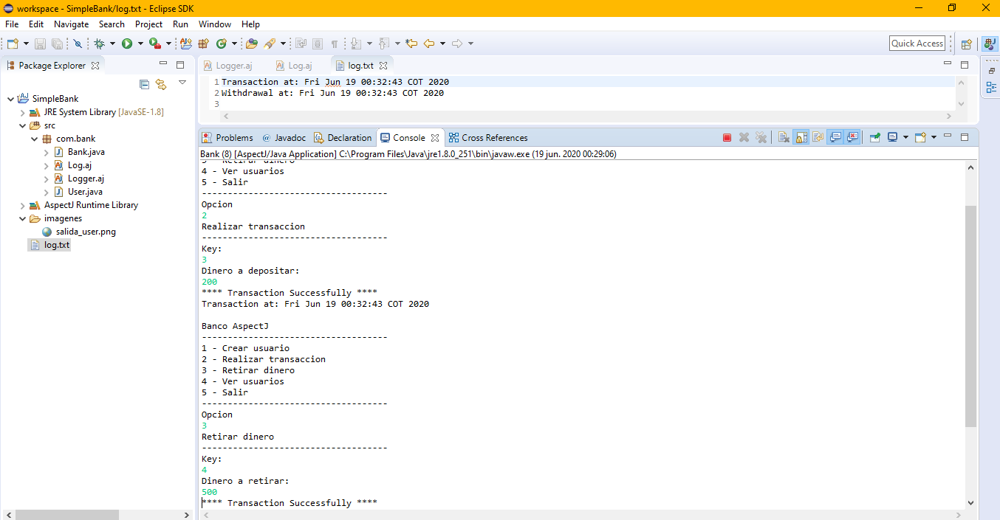

# Taller-AspectJ
Este taller consiste en practicar el uso del Paradigma Orientado a Aspecto
## Ejemplo de funcionamiento del aspecto logger "User created"

## Ejemplo de funcionamiento del aspecto log
Este funcionamiento guarda los tiempos y el tipo de transaccion en un archivo de texto "log.txt"

